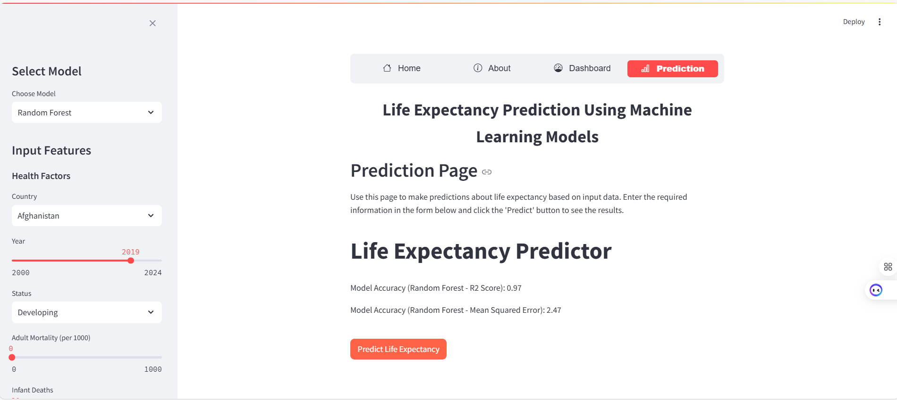

# Life Expectancy Prediction Using Machine Learning

## Overview
This project, titled **"Life Expectancy Prediction Using Machine Learning"**, was developed as part of my final year thesis. The main goal of this project is to predict the lifespan of people in a given country using machine learning models. The models trained in this project provide predictions based on various health and socio-economic factors.

## Key Components:

### 1. Objective:
The primary aim of this thesis was to estimate life expectancy by leveraging machine learning techniques. Two machine learning models, **Decision Tree** and **Random Forest**, were employed for this task. After testing multiple algorithms, these two models were chosen for their superior performance.

### 2. Dataset:
The **WHO Life Expectancy Dataset** was used for training the models. This dataset contains information from various countries, including factors like GDP, healthcare expenditure, immunization rates, and mortality rates, which are used to predict life expectancy.

### 3. Data Preprocessing:
- **Data Cleaning**: Before training the models, the dataset was cleaned to handle missing values, outliers, and irrelevant features.
- **Feature Engineering**: Additional features were created, and the most relevant features were selected to improve model performance.
- **Data Visualization**: We used **Power BI** and **Streamlit Dashboards** to visualize the dataset and gain insights into life expectancy trends.

### 4. Machine Learning Models:
We experimented with several machine learning algorithms and ultimately chose **Decision Tree** and **Random Forest** for their high accuracy and low error rates. Here's a summary of the model performance:

- **Decision Tree**:
  - **Mean Squared Error (MSE)**: 1.19
  - **Model Score**: 0.92

- **Random Forest**:
  - **Mean Squared Error (MSE)**: 1.17
  - **Model Score**: 0.97 (Best performance)

### 5. Tools Used:
- **Python**: For building and training the machine learning models.
- **Power BI**: For data visualization and analysis.
- **Streamlit**: For building an interactive web-based dashboard to display model predictions.

### 6. Results and Recommendations:
- The **Random Forest** model outperformed the **Decision Tree**, providing a lower MSE and higher model score. 
- Based on the findings, several recommendations were made, including:
  - **Improving the health system**: Better healthcare systems could lead to improved life expectancy in various countries.
  - **Insurance companies**: The insights from this project can be valuable to insurance companies for evaluating risks based on predicted life expectancy.

### 7. User Interface:
The project includes a **Graphical User Interface (GUI)** that allows users to input relevant data and obtain life expectancy predictions. The GUI provides an easy-to-use interface powered by Streamlit.

## Sample Application View


## How to Use the Application

1. **Clone the Repository**:
   ```bash
   git clone https://github.com/yourusername/life-expectancy-prediction.git
